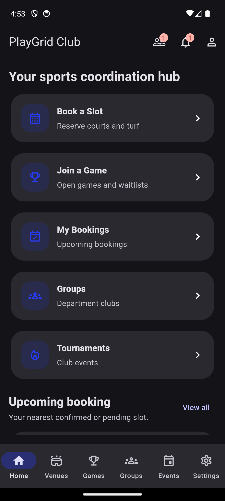
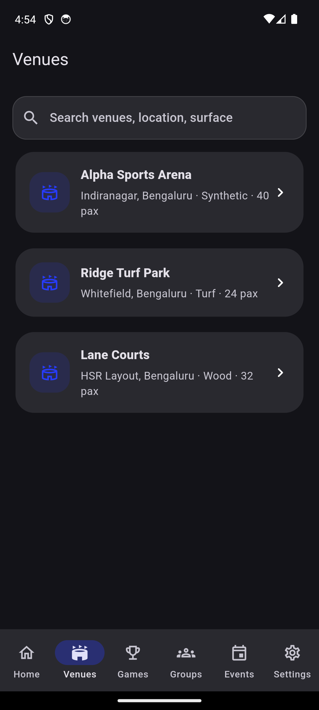
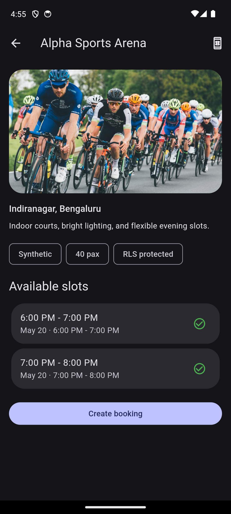
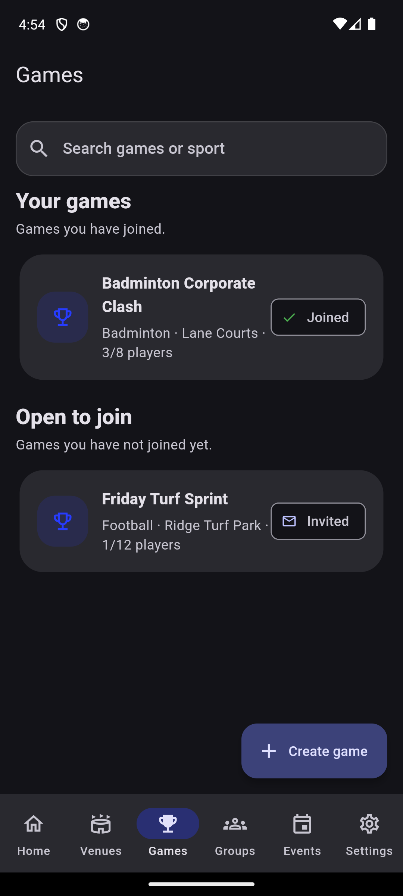
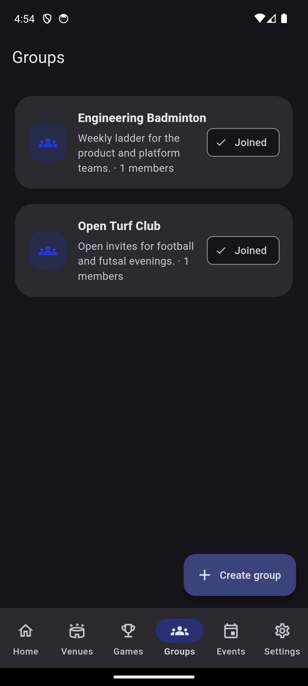
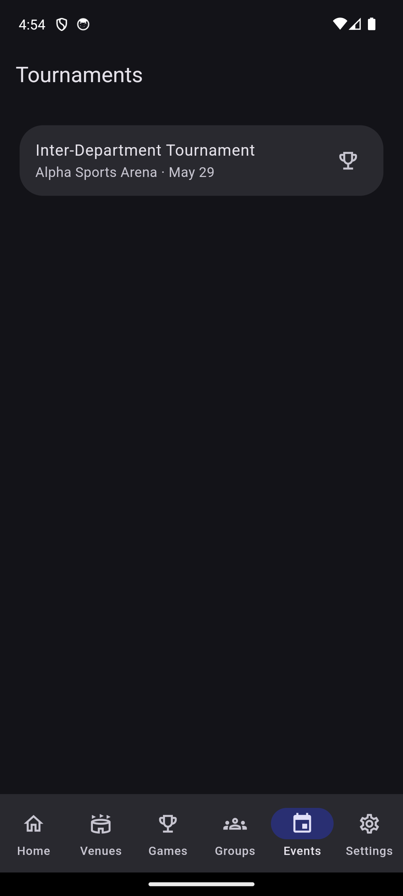

# PlayGrid Club — One-Page Pitch

**Your organization's sports, in one app. Live in days, not months.**

| | |
|---|---|
| **Prepared by** | Venkatakrishnan Ramesh |
| **For** | _< client / organization name >_ |
| **Date** | 2026-05-27 |
| **Ask** | ₹30,000 one-time build · ₹10,000 to start · ~₹4,675/mo hosting |

---

## The problem

Right now your members coordinate sport over WhatsApp groups, paper
sign-up sheets, and word of mouth. Courts get double-booked. Games
fall apart because nobody knows who's in. Admins chase people
manually. There's no single place to see what's happening.

## The solution

**PlayGrid Club** is a branded Android app that puts your venues,
games, and members in one place — already built, ready to brand with
your name and colours.

- **Book a court without conflicts.** The booking engine guarantees no
  two people grab the same slot — handled at the database level, not
  hoped for in the UI.
- **Find or start a game.** Members create open games, others join,
  and a waitlist fills no-shows automatically.
- **See everything live.** Venues, slots, groups, events, and
  tournaments — browsable, with in-app notifications.
- **Profiles that mean something.** Per-sport skill levels so people
  match with the right partners.
- **Admin control.** A dashboard to manage venues and slots, built for
  your coordinators.

## See it in action

Real screens from the working app (dark theme, seeded with sample
venues, games, and groups):

| Home hub | Venues | Book a slot |
|:---:|:---:|:---:|
|  |  |  |

| Games | Groups | Tournaments |
|:---:|:---:|:---:|
|  |  |  |

## Why this, why now

- **It already exists.** This isn't a "we'll build it" promise — it's a
  working app you can see today. The ₹30,000 covers branding it for you
  and shipping it to your Play Store, not building from zero.
- **Live in ~4 working days.** Sign-off and assets today → branded
  build on a device by day 2 → on the Play Store internal track by
  day 4.
- **Cheap to run.** Hosting starts at effectively ₹0 on Supabase's free
  tier for a small launch, scaling to ~₹4,675/month only as you grow.
  No surprise infrastructure bills.
- **You own your data.** Your members, venues, and bookings live in
  your own Supabase project under your control.

## What you get for ₹30,000

A branded, signed Android app on your Google Play internal-testing
track · your own Supabase backend with schema, conflict-free booking,
and seed data · one round of branding (name, colour, icon, splash) ·
source code in your GitHub org · a 30-minute handover walkthrough ·
**14 days of free bug-fix support** after launch.

## The numbers at a glance

| | |
|---|---:|
| One-time build | **₹30,000** |
| To start today (advance) | **₹10,000** |
| Balance on delivery | **₹20,000** |
| Monthly hosting (Supabase, billed to you) | **~₹4,675/mo** (free tier to start) |
| Google Play registration (one-time, to Google) | ₹2,000 |

Optional later, quoted separately: push notifications, iOS, UPI
payments, image uploads, live presence, multi-org. See
[`estimate.md`](estimate.md) and
[`launch-and-running-costs.md`](launch-and-running-costs.md) for the
full breakdown.

## Next step

Say yes today, send the ₹10,000 advance and your branding assets
(name, logo, colour, sports + venue lists), and your members are
booking courts inside a week.

> _Built and delivered by Venkatakrishnan Ramesh · github.com/Venkatakrishnan-Ramesh_
